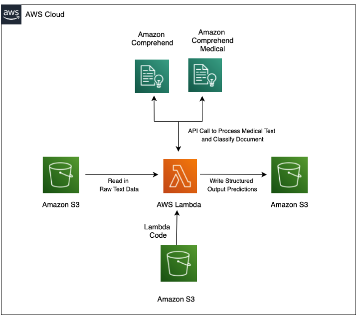

# Integrate Amazon Comprehend Medical with Custom Code and Models

*This code repository supports the blog post `Enrich Amazon Comprehend Medical with Custom Code and Models`. Please see that blog for step-by-step instructions and further details for deploying this solution. Much of the content in this repository is copied from there.*

## Introduction

Extracting important information from unstructured medical and healthcare texts like transcribed physician notes is a key step in understanding the content of such documents, yet many healthcare and life sciences organizations struggle with this. Manually extracting the data is a time consuming process, while automated rule-based attempts to extract the data don’t capture the full story as they fail to take context into account.

[Amazon Comprehend Medical](https://aws.amazon.com/comprehend/medical/) is a HIPAA-eligible natural language processing (NLP) service that can quickly and accurately extract information such as medical conditions, medications, dosages, tests, treatments and procedures, and protected health information while retaining the context of the information. An important feature behind Amazon Comprehend Medical is that you can use it with a simple API call – and you don’t have to be a machine learning practitioner to take advantage of it. Amazon Comprehend Medical comes with a number of built-in features, such as identifying tests, treatments, and procedures (labeled as `TEST_TREATMENT_PROCEDURE`)as well as many [other identities](https://docs.aws.amazon.com/comprehend/latest/dg/extracted-med-info.html).

Developers, however, may be interested in integrating bespoke logic with Amazon Comprehend Medical’s output. For instance, there may be specific non-standard healthcare terminology or other domain-specific language they may need to detect in the medical text. For these use cases, customers may want to augment Amazon Comprehend Medical’s output with custom code and algorithms. Furthermore, they may be interested in in combining Amazon Comprehend Medical’s output with other machine learning models. Thus, the ability to enrich Amazon Comprehend Medical’s powerful built-in capabilities with custom code may lead to solutions even more tailored to developers’ needs. 

In this post, we walk through how to integrate Amazon Comprehend Medical with custom code, including a machine learning model. 

## Use Case

The use case for this is as follows: your company stores medical transcripts and notes on [Amazon S3](https://aws.amazon.com/s3/). You are interested in extracting entities, such as Protected Health Information (PHI; e.g. patient name), as well as other critical entities such as prescriptions and diagnoses that can be accurately identified by Amazon Comprehend Medical. In addition, in order to automatically determine how the transcript should be filed within your database, you need to predict the medical specialty that best matches the transcript. For example, medical transcripts related to surgical procedures should be matched to the category “Surgery”, while those that appear to be radiology related should be filed under “Radiology”. Finally, your company is specifically analyzing patients who are at risk of developing breast cancer. Thus, you need to specifically identify which (if any) gene names in the medical note mention genes that [when mutated](https://www.komen.org/breast-cancer/risk-factor/inherited-genetic-mutations/) increase the risk of breast cancer. For example, the [BRCA2 gene](https://en.wikipedia.org/wiki/BRCA2#:~:text=BRCA2%20is%20a%20human%20tumor,is%20responsible%20for%20repairing%20DNA.) should be specifically annotated as a breast cancer gene.

This solution walks through how to deploy:

1. An Amazon Comprehend Custom Model to classify the Medical Specialty of the physician's note.
2. Deploying a custom algorithm to augment Amazon Comprehend Medical's output. 

## Architecture

The architecture deployed within this solution is:

## Model Information and Overview

This section provides a general overview of the components deployed via this solution; you may skip to the section **Deploy a Lambda Function to Augment and Enrich Amazon Comprehend Medical Output** if you wish to. 

### Amazon Comprehend Custom Classifier

The [Amazon Comprehend Custom Classifier](https://docs.aws.amazon.com/comprehend/latest/dg/how-document-classification.html) model that will be deployed categorizes each of the transcripts as surgery, radiology, general medicine or urology. The dataset we will train the classifier on contains mock physician transcripts extracted from the [Mtsamples dataset](https://www.mtsamples.com/) and downloaded from [Kaggle](https://www.kaggle.com/tboyle10/medicaltranscriptions). This data set contains a list of medical transcriptions as well as the corresponding medical specialty the transcriptions fell under; the classifier will predict the medical specialty given the transcription text. 

We cleaned up this dataset by using [Amazon SageMaker Data Wrangler](https://aws.amazon.com/sagemaker/data-wrangler/). The transformations included removal of any duplicate medical transcriptions and combined a few of the medical specialty categories that did not have enough documents to be able to train the classifier on its own (Note: Amazon Comprehend requires at least 50 documents per category). Once we added those transformations to the data, we exported and ran our Data Wrangler job. The results from our job were outputted to S3. Here are the categories we were left with after making those transformations:

At this point, we could have trained the custom classifier with all of the data that was outputted by Data Wrangler, but due to the unbalanced nature of the data (surgery is more than 60% of the dataset) and to speed up training time, we chose a subset of our overall dataset (50 documents each) to train our classifier on. We created a new custom classifier using Amazon Comprehend and selected our training data from S3. Overall, it took about 40 minutes to train our classifier. 

### Deploying a Custom Algorithm to Augment Amazon Comprehend Medical Output

The Amazon Comprehend Medical output can be augmented with simple algorithmic tools. The custom Amazon Comprehend model above achieves the goal of detecting the speciality of the transcript. The next goal is to detect breast cancer genes in the text. While Amazon Comprehend Medical may identify a gene as a medical entity, we will specifically enrich the Amazon Comprehend Medical output with domain-specific breast cancer information by annotating as `BREAST_CANCER_GENE` genes that can increase risk of breast cancer when the patient inherits a mutated copy. To do this, we first manually curated from the Susan G. Komen Institute [website](https://www.komen.org/breast-cancer/risk-factor/topics/inherited-genetic-mutations/) a list of genes that when mutated increase the risk of breast cancer . The list of genes we used is [here](https://github.com/aws-samples/amazon-comprehend-medical-enrich-custom-models/blob/main/files/list_of_genes.txt).

We then leverage an algorithmic heuristic approach that uses edit distance to discover breast cancer genes in the medical text; we chose to use the Smith-Waterman (SW) algorithm (implemented in this library). The [Smith-Waterman](https://en.wikipedia.org/wiki/Smith%E2%80%93Waterman_algorithm) algorithm is heavily used in the bioinformatics and computational biology community to detect similarity in DNA and protein sequences (for example, see [this](https://cse442-17f.github.io/Prims-and-A-Star/) webpage where you can graphically test out Smith-Waterman on DNA sequences). However, it can also be used to detect similarities between any two texts. For example, if a physician accidentally misspelled the gene as BARCA2, the Smith-Waterman algorithm will still attempt to match the word against the correctly spelled BRCA2 gene, and assign a score accordingly. Note that the Smith-Waterman algorithm is only one of many algorithms that relies on computing edit distances between strings. 

We normalized the Smith-Waterman score so that 0 is a complete non-match, and 1 is an exact match; the specific score assigned is dependent on parameters used when running the SW algorithm. Matches and scores are schematically shown in the examples below:

As expected, while BARCA has a high partial match score to BRCA, BOOTS and POTENT have a low and zero score respectively. In the step-by-step guide below, only entities that match the gene names with a confidence of .75 or above (the maximum score is 1) is reported. The function then enriches the Amazon Comprehend Medical string and returns the result.

 
A key value of this approach is that it **leverages Amazon Comprehend Medical’s robust capability of identifying named entities within medical text**, and simply augments it with specialized information. This saves development time, because Amazon Comprehend Medical can do the heavy lifting of **identifying** named entities, while the custom code can augment the named identities with specific subject matter data (in this case, whether an identified entity is a breast cancer gene). Of course, there may be cases where you are interested in identifying the names of the genes irrespective of whether it is identified as a named entity by Amazon Comprehend Medical. This function does so also, reporting it is a separate section.

Amazon Comprehend Medical returns results as standard JSON strings. We integrate our custom algorithm and model with Amazon Comprehend Medical by simply augmenting and enriching the returned JSON string within a Lambda function.
Then, we parse the JSON strings and extract the entities from Amazon Comprehend Medical; each of these entities is the compared seriatim to a pre-defined list of breast cancer genes using the SW algorithm. 

## Prerequisites
You need the following prerequisites before you can proceed with this solution:

	* Access to the AWS Console

	* Permission to create AWS CloudFormation Stacks.

	* Access to Amazon Comprehend Medical and Amazon Comprehend.

## Deploy a Lambda Function to Augment and Enrich Amazon Comprehend Medical Output

### Deploy a Custom Comprehend Model for Document Classification

The first step is to train and deploy a Comprehend Custom Document Classification Model, which you will do in a no-code fashion from the [AWS Management Console](https://aws.amazon.com/console/). These steps are configured for the us-east-1 region. You will need to modify these steps if you are deploying your Custom Comprehend model to another region. [See](https://aws.amazon.com/about-aws/global-infrastructure/regional-product-services/) here for a list of regions where Comprehend is available.

1. First, navigate to the Comprehend console [here](https://console.aws.amazon.com/comprehend), choose `Launch Amazon Comprehend` and then choose `Custom Classification` from the sidebar on the left. 

2. Next, click `Train Classifier` button:

3. Under Classifier Settings, fill in `medical-specialty-classifier` as the `Name` of the classifier and ensure that `English` is the language selected.

4. For `Classifier mode`, select `Using Multi-class mode` and for `Training Data Format` select `CSV file`

5. Next, enter the S3 URI of the data that will be used to train the classifer. The S3 URI is:  `s3://aws-hcls-ml/blog_post_support_materials/comprehend_medical_custom_lambda_code/processed_mtsample_data/Training_Data.csv` 
   * **Note**: if you are working in a region other than `us-east-1,` please copy the data into an S3 bucket that is located in the region you are working in and modify the location of the S3 URI accordingly. This step is required because the custom training data provided to Custom Comprehend Models must be in the same region as the model that will be deployed.
6. Under `Output Data`, please enter the S3 URI of the bucket that you want Comprehend to output to. This can be any bucke that you have permission to write to.
7. In the `Access Permissions` section, select `Create an IAM Role `and enter `medical-specialty-classifier` as the name suffix

8. Leave the rest of the options as default, scroll to the bottom, and click `Train classifier`
9. After a few seconds, this will be begin the process of training the custom document classifier
    * Note: this training will take about 45 minutes.

10. Now, in order for Amazon Comprehend to be able to provide insights in real time from our new custom model, we need to use an endpoint. In order to create an endpoint, we must first wait until the training (from the previous step) is completed.
11. Next, inspect the model performance to see that it is satisfactory (note: your classifier performance may differ slightly from ours). The model performance for our trained model was 
12. When the training is completed, click on the name of your new custom classifier. Scroll down to the `Endpoint` section and click `Create endpoint`. 

13. For the `Endpoint name`, fill in `medical-specialty-classifier-endpoint`, for `Inference units`, fill in `1`, and then select `Create endpoint`
    1. Note: this will take about 5-10 minutes to create

14. Once your endpoint has been created, please take note of the endpoint’s ARN. We will be using its ARN in the next section. 
    1. Note: Make sure to copy the ARN of the ENDPOINT, not the classifier’s ARN. The endpoint’s ARN can be found here: 

15.	(**Optional**) The following step is optional, but illustrates how you can dig deeper into the Comprehend Custom classifier performance. To do this, we will be running the Comprehend Custom classifier on a separate testing set, and plotting the results.
	1. Click on you classifier, and then click on `Create Job`. 
	2. After assigning a name to your job, for `Input Data`, enter `s3://aws-hcls-ml/blog_post_support_materials/comprehend_medical_custom_lambda_code/processed_mtsample_data/Testing_Data_without_labels.csv`. For output data, choose a bucket you have permission to write to.
	3.	For access permissions, click `Create an IAM role`. 
	4.	Click `Create job`
	5.	After a few minutes, the job will finish. Download the results, unzip the *tar.gz* file, and run the code provided [here](https://github.com/aws-samples/amazon-comprehend-medical-enrich-custom-models/blob/main/files/Confusion_Matrix.ipynb). The output will look like: 

You can see from this confusion matrix overall that the model is performing well, but is able to predict certain classes (e.g. Radiology) with a higher degree of confidence than the than others classes. 

### **Deploy a Lambda Function to Integrate Amazon Comprehend Medical with Custom Model and Custom Code**

Next, download and deploy [this](https://github.com/aws-samples/amazon-comprehend-medical-enrich-custom-models/blob/main/files/cfn_lambda_cm_comprehend_custom.yaml) CloudFormation (CFN) Template, and deploy it via the [CloudFormation console](https://console.aws.amazon.com/cloudformation/home?region=us-east-1). The CFN template is available in this repository in the file `cfn_lambda_cm_comprehend_custom.yaml` As before, this CFN is configured to run out-of-the-box in the `us-east-1` region. If you are running it in any other region, you will have to modify some of these steps.
When you deploy it, Please keep all other values in the CFN as the defaults value:

1. Open `CloudFormation` in the AWS Console and click `Create Stack`
2. Under `Prepare template`, choose `Template is ready`, and under `Template source`, choose `Upload a template file` and select `Choose file`. Browse through your files and select the CloudFormation template that you just downloaded. Once you’ve selected the file, click `Next`

3. Now enter `Enriched-Comprehend-Medical` as the `Stack Name`, enter the ARN of the custom endpoint you created as the `ComprehendCustomEndpoint,` it will look something like this: `arn:aws:comprehend:us-east-1:`xxxxxxxxxxxx`:document-classifier-endpoint/speciality-detector-endpoint`. Then select `Next`

**Note:** If you are deploying CFN from region *outside* of us-east-1, you will first need to copy the lambda code into your own bucket in the region that you are deploying it from. Specifically, copy `s3://aws-hcls-ml/comprehend_medical_custom_lambda_code/functions/packages/MyFunction/lambda.zip` into your own new bucket. Then, modify `StaticCodeBucket` and `StaticCodeKey` accordingly.
1. Click through the rest of the steps, and check the box that says “**I acknowledge that AWS CloudFormation might create IAM resources.”** If you agree.
2. Click on "Create stack button“
3. After about 5 minutes, the stack is created. Look at the `Outputs` tab to see the names of the buckets created:

The CloudFormation template creates:

* An input bucket where source data will be processed (“InputBucket”). The name of your bucket will differ from ours, since bucket names are globally unique.
* An output bucket (“ResultsBucket”, where processed data is put)
* A lambda function that performs the processing discussed above, including passing data to Comprehend Medical, augmenting the Comprehend Medical output based on the Smith-Waterman algorithm, and run the Custom Comprehend Model. 
* A trigger between the input bucket and the lambda function. You can read more about setting up triggers between S3 and Lambda on [this documentation page](https://aws.amazon.com/premiumsupport/knowledge-center/cloudformation-s3-notification-lambda/).

The CloudFormation template will take about 5 minutes to deploy, and the results of the created resources are shown in the `Outputs` Tab. 

### Test the Lambda Function. 

Now that we have deployed our lambda function, let us test it with a small sample document.

1. Download the sample document from [here](https://github.com/aws-samples/amazon-comprehend-medical-enrich-custom-models/blob/main/files/sample_doc_in.txt). The document consists of just one sentence:
    `The patient has a BRCA2 mutation, and she was diagnosed with breast cancer one year ago.`
2. Copy the document into the InputBucket (either using the console or the CLI) you created from the CFN. For example, mine is called `enriched-comprehend-medical-notificationbucket-11agxbkaav8eu`
3. After waiting about 30 seconds (to give the Lambda function time to process the file), check the contents of ResultsBucket; it should contain a file that contains the results of the Lambda function in JSON format. The raw results can be found [here](hhttps://github.com/aws-samples/amazon-comprehend-medical-enrich-custom-models/blob/main/files/sample_doc_in.txt_out), but for clarity we also show them below. We have highlighted in peach the additional parts of the JSON object that are not included in regular Comprehend Medical.

In the JSON output below  the highlighted components are the parts added by our custom augmenting of Comprehend Medical. Note that the phrase “BRCA2 mutation” (in addition to being annotated as a `Diagnosis`) is now also annotated as a `BREAST_CANCER_GENE`. Furthermore, the document is annotated as 84% probability of belonging to General Medicine, with other classes being scored lower. 

## Cleanup

First, you will need to delete the Comprehend Custom endpoint to prevent recurring charges. Please navigate to the Comprehend console, select the model you created,  navigate to the created endpoint, and delete the endpoint.

Next, you need to delete the resources that were copied into the S3 buckets (otherwise the CloudFormation rollback will fail). As mentioned above, you can get these bucket names from the CloudFormation console. From the command line, you can delete the data in these buckets (note that your bucket names will differ from ours) as follows:
 `aws s3 rm s3://enrich-comprehend-medical-notificationbucket-na5rpsp3mvhh --recursive;aws s3 rm s3://enrich-comprehend-medical-outputbucket-rc1n5hsykhmq/ --recursive`

Alternatively, you can delete the data manually from the console by emptying each bucket individually. Once this is done, click on the `Enrich-Comprehend-Medical` Stack, and click `Delete` to delete it.

## References

* Sample data – [Medical Transcriptions](https://www.kaggle.com/tboyle10/medicaltranscriptions)
* Original data source – [MTSamples](https://www.mtsamples.com/)

## Notes

1. If you wish to compile the Lambda function manually, you can do so by entering the `files/lambda_code` directory and (on Linux or a Mac), type `sh install_lambda_function_requirements.sh`. You must have python3.6/python3.7 and pip installed if you compile the the lambda function yourself.

## Security

See [CONTRIBUTING](CONTRIBUTING.md#security-issue-notifications) for more information.

## License

This library is licensed under the MIT-0 License. See the LICENSE file.

